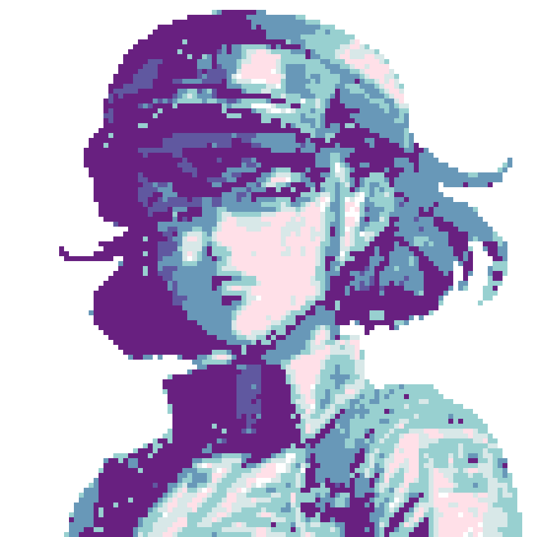

# 🖌️ Pixelate

Ta aplikacja to magiczny kreator pixel artu! Wczytaj swoje zdjęcie, a potem  dostostosuj współczynnik `Factor`, decydującego o wielkości pikseli w twoim pixel art. Możesz też wybrać metodę `Dithering`, która jest trochę jak wybór sosu do frytek — każdy ma inny smak, a różne metody dadzą różne efekty. Po ustawieniu wszystkiego według twojego gustu naciśnij `Pyxelate Image` i poczekaj, aż magia się wydarzy. Na koniec, możesz zapisać swoje arcydzieło na dysku twardym. To narzędzie jest jak podróż w czasie do ery 8-bitowej grafiki!


###### Autorzy: _Jakub Stolarczyk & Filip Rzepka_

---
## 📋 Spis treści

- [🖌️ Pixelate](#️-pixelate)
        - [Autorzy](#autorzy)
  - [📋 Spis treści](#-spis-treści)
  - [⏩ Instalacja](#-instalacja)
      - [Opcja 1](#opcja-1)
      - [Opcja 2](#opcja-2)
  - [🔧 Sposób użycia](#-sposób-użycia)
  - [🖼️ Przykłady](#️-przykłady)
  - [⚙️ Technologia](#️-technologia)

---
## ⏩ Instalacja

Aplikację możesz uruchomić na dwa sposoby:

#### Opcja 1
*Ściągnięcie skompilowanego pliku `.exe`*

[Tutaj](https://drive.google.com/file/d/1qaJgZuYR9tPifhvnt1V5sVGcFIlsz0eu/view?usp=sharing) znajduje się link do pliku na Google Drive. Po prostu ściągnij plik i ciesz się działającą aplikacją.

#### Opcja 2
*Ściągniecie całego repozytorium*

1. Otwórz wiersz poleceń w folderze, gdzie chcesz mieć repozytorium i użyj następującej komendy:

```bash
git clone https://github.com/jakestolarsky/Pixelate_app.git
```
2. Następnie zainstaluj wszystkie niezbędne biblioteki z pliku `dependencies.txt`. Możesz użyć następującej komendy:

```bash
pip install -r dependencies.txt
```

3. Po zainstalowaniu wszystkich niezbędnych bibliotek uruchom plik `Pixelate.py`

---
## 🔧 Sposób użycia

| Opcja | Opis |
|--|--|
| `Load Image` | To przycisk, za pomocą którego możesz załadować zdjęcie ze swojego dysku (w formacie `.png` lub `.jpg`). |
| `Save Image` | Za pomocą tego przycisku, możesz zapisać przerobiony obrazek na swoim dysku. |
| `Factor` | Za pomocą tego parametru możesz ustalić jak bardzo twój obrazek, ma być rozpikselowany. Rozmiar przekształconego obrazu będzie równy `1/Factor` oryginału |
| `Dithering` | Możesz wybrać rodzaj ditcheringu. Każdy będzie wyglądał inaczej, spróbuj sam i wybierz swój ulubiony. |
| `Pyxelate Image` | Po wybraniu wszystkich opcji kliknij, aby obrazek został przerobiony. Czasem może zabrać to sporo czasu. |

>❗ Ważne
Im mniejszą wartość `Factor` ustawisz tym dłużej, możesz czekać na rezultat. Tak samo opcje `Dithering` również wymagają cierpliwości.

---
## 🖼️ Przykłady

Poniżej znajdują się przykłady pokazujące efekty, jakie możesz osiągnąć tym narzędziem.

|Oryginał|Po użyciu Pixelate|
|--|--|
|  |  |
|   |   |
|   |   |
|   |   |
|   |   |

---
## ⚙️ Technologia

Aplikacja została sworzona w języku `Pyhon`, a głównym silnikiem napędowym, na którym się opiera, jest biblioteka *[Pyxelate](https://github.com/sedthh/pyxelate#readme)*. Interface graficzny został stworzony za pomocą biblioteki *[Kivy](https://kivy.org/)*. Przkładowe obrazki zostały wygenerowane za pomocą narzędzia *[Leonardo.ai](https://leonardo.ai/)*