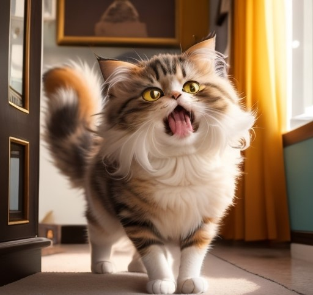
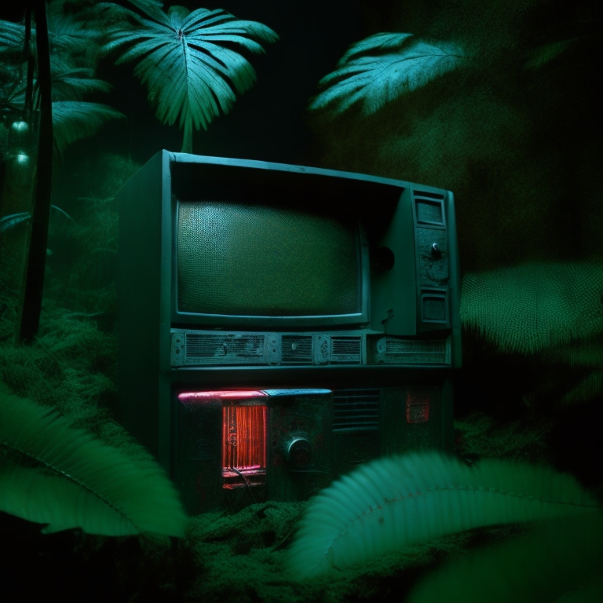

# 🖌️ Pixelate

This application is a magical wizard of Pixel Art! Load your photo and then get the `Factor` slider, determining the size of the pixels in your pixel art. You can also choose the `Dithering` method, which is a bit like choosing a fries sauce - everyone has a different taste, and different methods will give different effects. After setting everything according to your taste, press 'Pyxlate Image' and wait for the magic to happen. Finally, you can save your masterpiece to the hard disk. This tool is like traveling in time to the 8-bit graphics era!

Author: _Jakub Stolarczyk_


---
## 📋 Table of Contents

- [🖌️ Pixelate](#️-pixelate)
      - [Author](#author)
  - [📋 Table of Contents](#-table-of-contents)
  - [⏩ Installation](#-installation)
      - [Option 1](#option-1)
      - [Option 2](#option-2)
  - [🔧 How to Use](#-how-to-use)
  - [🖼️ Examples](#️-examples)
  - [⚙️ Technology](#️-technology)

---
## ⏩ Installation

You can start the application in two ways:

#### Option 1
*Downloading the compiled `.exe` file*

[Here](https://drive.google.com/file/d/1qaJgZuYR9tPifhvnt1V5sVGcFIlsz0eu/view?usp=sharing) is a link to the file on Google Drive. Just download the file and enjoy the working application.

#### Option 2
*Download the entire repository*

1. Open the command line in the folder where you want to have the repository and use the following command:

```bash
git clone https://github.com/jakestolarsky/Pixelate_app.git
```
2. Then install all necessary libraries from the `dependencies.txt` file. You can use the following command:

```bash
pip install -r dependencies.txt
```

3. After installing all necessary libraries, run the `Pixelate.py` file

---
## 🔧 How to Use

| Option | Description |
|--|--|
| `Load Image` | This button allows you to load a photo from your disk (in `.png` or `.jpg` format). |
| `Save Image` | With this button, you can save the modified image to your disk. |
| `Factor` | This parameter allows you to determine how much your picture will be pixelated. The size of the transformed image will be equal to `1/Factor` of the original |
| `Dithering` | You can choose the type of dithering. Each will look different, try for yourself and choose your favorite. |
| `Pyxelate Image` | After selecting all options, click to have the image processed. Sometimes it may take a long time. |

>❗ Important
The smaller the `Factor` value you set, the longer you may wait for the result. Similarly, the `Dithering` options also require patience.

---
## 🖼️ Examples

Below are examples showing the effects you can achieve with this tool.

|Original|After Using Pixelate|
|--|--|
|  |  |
|   |   |
|   |   |
|   |   |
|   |   |

---
## ⚙️ Technology

The application was created in `Python`, and the main engine it is based on is the *[Pyxelate](https://github.com/sedthh/pyxelate#readme)* library. The graphical interface was created using the *[Kivy](https://kivy.org/)* library. The example images were generated using the *[Leonardo.ai](https://leonardo.ai/)* tool.
